# 🌟 AURA
> **Boost ton Aura, illumine ta réussite.**

 


## 📖 À propos

**AURA** est bien plus qu'une application de révision. C'est un compagnon d'apprentissage intelligent conçu pour réduire la charge mentale des étudiants. 

En fusionnant la **psychologie cognitive**, la **bioluminescence digitale** et l'**Intelligence Artificielle**, AURA transforme le stress des révisions en un flux de sérénité et de maîtrise.

### ✨ Fonctionnalités Clés

* **⚛️ Sessions Atomiques :** Des cycles de révision ultra-courts (6 min) pour maximiser la rétention (Micro-learning).
* **🤖 Laura (AI Coach) :** Une entité bienveillante qui guide, donne des indices socratiques et encourage, sans jamais juger.
* **💎 Système d'Aura :** Une gamification visuelle et apaisante. Plus l'élève apprend, plus son orbe (généré procéduralement) brille et se complexifie avec des étoiles.
* **🌑 Dark Mode Natif :** Une interface "Digital Bioluminescence" conçue pour réduire la fatigue oculaire et favoriser le focus nocturne.
* **📊 Smart Dashboard :** Sélection rapide des matières (Maths, Histoire, etc.) via des puces néon interactives et suivi des Streaks (séries) pour motiver la régularité.

---

## 🛠 Stack Technique

Ce projet utilise le **"2026 Power Trio"** pour une performance et une scalabilité maximales.

| Brique | Technologie | Rôle |
| :--- | :--- | :--- |
| **Frontend** |  | UI/UX Pixel Perfect, Animations fluides (Skia). |
| **Langage** |  | Logique métier robuste. |
| **Backend** |  | Base de données PostgreSQL, Auth, Edge Functions. |
| **Intelligence** |  | Moteur logique de Laura (GPT-4o). |

---

## 🏗 Architecture & Conception

### 1. Diagramme de Cas d'Utilisation
Les interactions principales de l'élève avec le système.

```mermaid
usecaseDiagram
    actor Élève as "👤 Élève"
    
    rectangle "Application AURA" {
        usecase "Lancer une Session Atomique" as UC1
        usecase "Répondre aux questions" as UC2
        usecase "Consulter son Aura (Stats)" as UC3
        usecase "Gérer ses matières" as UC4
        usecase "Demander un indice (Laura)" as UC5
    }

    rectangle "Laura (IA)" {
        usecase "Suggérer une piste socratique" as UC6
    }

    Élève --> UC1
    Élève --> UC2
    Élève --> UC3
    Élève --> UC4
    Élève --> UC5
    UC5 --> UC6
```

### 2. Diagramme de Séquence
Flux d'une session atomique complète.

```mermaid
sequenceDiagram
    autonumber
    actor User as Élève
    participant App as Flutter App
    participant DB as Supabase
    participant AI as Laura (AI)

    User->>App: Lance une session "Maths"
    App->>DB: Request: Get 5 Questions (Algorithm)
    DB-->>App: Return: JSON Questions
    
    loop Session Loop
        App->>User: Affiche Question
        User->>App: Réponse Erronée
        App->>AI: Envoi Erreur + Contexte
        AI-->>App: Retourne Indice Socratique
        App->>User: Affiche Bulle Laura (Indice)
        User->>App: Réponse Correcte
        App->>App: Calcul Gain Aura (Animation)
    end

    App->>DB: Sauvegarde Session & Nouveau Score
    App->>User: Affiche écran "Victoire" (Aura Glow)
```



### 3. Diagramme de Classes
Structure des entités principales du système.

```mermaid
classDiagram
    class User {
        +UUID id
        +String username
        +int auraPoints
        +Level currentLevel
        +updateAura()
    }

    class Subject {
        +UUID id
        +String name
        +String iconPath
        +Color neonColor
    }

    class Session {
        +UUID id
        +DateTime date
        +int duration
        +int score
        +start()
        +finish()
    }

    class Question {
        +String content
        +String answer
        +String hint
    }

    User "1" *-- "*" Session : réalise
    Session "*" -- "1" Subject : concerne
    Session "1" *-- "5..*" Question : contient
```



---

## 🎨 Thème Digital Bioluminescence

Le thème dark mode "Digital Bioluminescence" est intégré dans l'application avec :

- **Deep Space Blue** (#0F172A) : Couleur de fond principale
- **Electric Cyan** (#00F0FF) : Couleur primaire pour les accents
- **Mint Neon** (#4ADE80) : Couleur de succès
- **Polices** : Inter (corps) et Space Grotesk (titres) via Google Fonts

Le thème est disponible dans `lib/config/theme.dart` et peut être utilisé via `AppTheme.darkTheme`.

---

## 🚀 Installation & Démarrage

### Prérequis
- Flutter SDK (>=3.0.0)
- Dart SDK
- Un émulateur ou appareil physique configuré

### Installation

1. Cloner le repository
```bash
git clone <repo-url>
cd aura_app
```

2. Installer les dépendances
```bash
flutter pub get
```

3. Lancer l'application
```bash
flutter run
```

### Structure du Projet

```
aura_app/
├── lib/
│   ├── config/
│   │   └── theme.dart          # Thème Digital Bioluminescence
│   ├── features/               # Modules fonctionnels
│   │   ├── auth/
│   │   ├── dashboard/          # Écran principal avec Orbe et Stats
│   │   ├── splash/             # Écran de lancement
│   │   └── learning/
│   ├── models/                 # Modèles de données
│   ├── providers/              # State management
│   ├── services/               # Services (API, IA, etc.)
│   ├── widgets/                # Composants réutilisables
│   └── main.dart               # Point d'entrée de l'application
└── pubspec.yaml
```

---